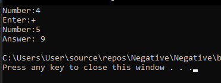
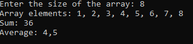

# console_app_csharp

1. Negative project 
   

   
2. Complex Creature 

   
3. Simple Calculator

   
4. Palyaco Man 

   
   

5. Tempurature 

   
   

6. Sum of Multiple

   

7. Array  

   

8.Array2

  